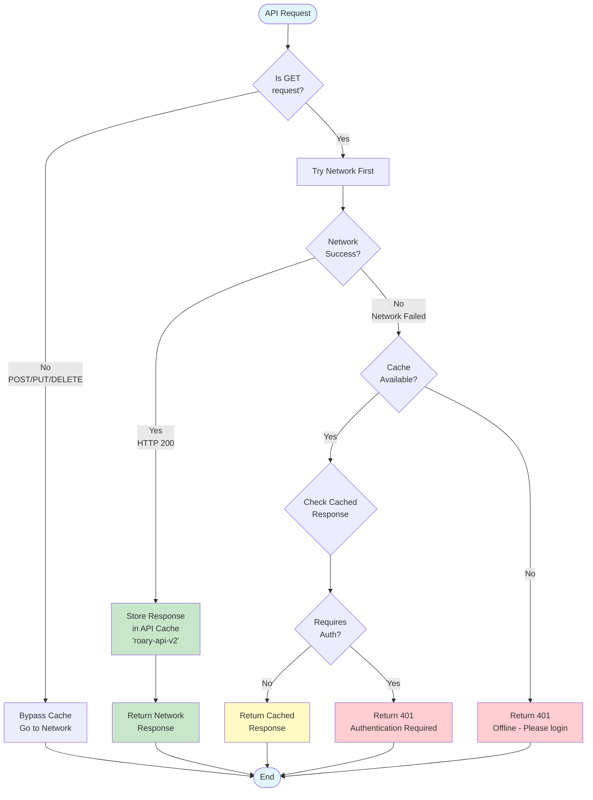

## caching using existing cache for static data 
API responses are cached in the Service Worker (worker.js) using the Browser Cache API.

## **Cache Configuration**

Cache Name: 'roary-api-v2' (line 3)
Separate from Static Cache: Uses dedicated cache storage independent of static assets cache ('roary-v6')

Caching Strategy: Network-First (lines 59-95)



How it works:

Primary: Always attempts to fetch from the server first
Cache Update: If successful (HTTP 200), stores response in API cache
Fallback: Only serves from cache when network is unavailable (offline)
Flow:

### Key Features
Authentication Awareness:

- Checks for requiresAuth flag in cached responses
- Returns appropriate 401 error messages when offline without valid cache
- Protects against serving stale authenticated content

Only GET Requests:
- POST/PUT/DELETE requests bypass cache completely
- Ensures write operations always hit the server
- 
## Cache Invalidation:

Message handler available to clear API cache via CLEAR_API_CACHE message (lines 183-201)

Currently used in profile.php:44
Current Behavior
- ✅ Always fresh when online - fetches latest data from server
- ✅ Offline support - serves cached responses when network unavailable
- ❌ Not optimized for speed - repeated requests always hit server
- ❌ Higher server load - no reduction in API calls for same data

## Task 2 Redis as Cache 

Task 2 focus on reducing database load by implementing Redis caching for frequently accessed data in the backend.

### Implementation Details
Implemented in Post.php. The Redis Database runs as a separate service alongside the main application database as a Docker container. Defined in the docker-compose.yml file.

```php
class Post extends Model
{
        public function __construct($database = null)
        {
            ...
        }
        private function initializeRedis(): void
        {
            ... 
        }
        private function populateTimelineCache(int $limit = 500): void
        {
            if (!$this->redis) return;
        }
        
        // A new post to redis cache
        public function createPost(string $username, string $content): ?int
        {
            ...
            if ($postId && $this->redis) {
                // Add to Redis timeline
                $this->redis->zAdd(
                    self::REDIS_TIMELINE_KEY,
                    (float)$timestamp,
                    (string)$postId
                );
            ... 
        }


}
```

Mainly when accessing data for timeline the system checks the redis cache first before querying the database.
```php 
if ($this->redis) {
    $postIds = $this->redis->zRevRange(
        self::REDIS_TIMELINE_KEY,
        $offset,
        $offset + $limit - 1
    );
    ...
}
```

Or when creating a new post the post id is added to the redis cache sorted set.


# Task 3 Load Testing with K6 

K6 is used to perform load testing on the application before and after implementing pagination and Redis caching. 


fla